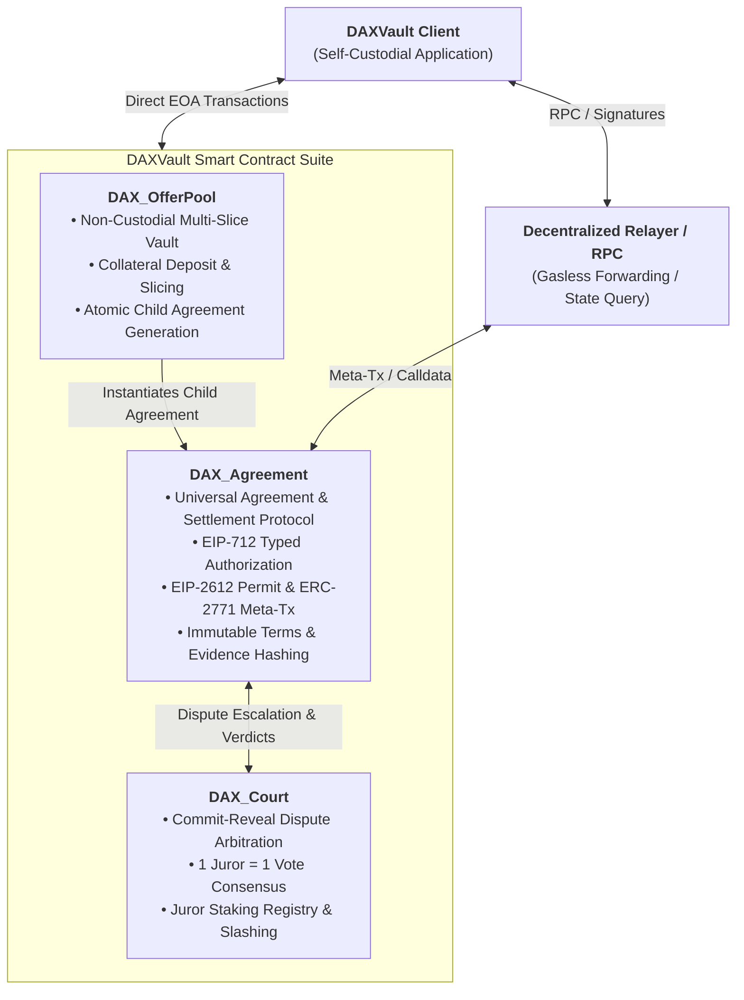
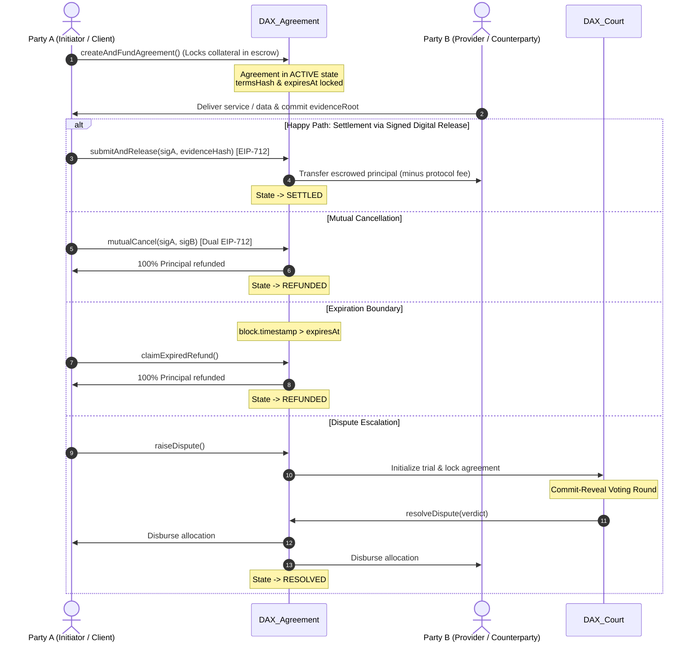

<p align="center">
  
</p>

<h1 align="center">DAXVault</h1>

<p align="center">
  <strong>Universal Trustless Digital Agreement & Multi-Chain Settlement Protocol</strong>
</p>

<p align="center">
  <a href="https://basescan.org">
    
  </a>
  <a href="https://github.com/DAXProtocol/dax/actions">
    
  </a>
  
  
  
  
</p>

---

## Overview

**DAXVault** is a fully on-chain, self-custodial digital agreement and multi-chain settlement protocol. It enables counterparties to enter into deterministically enforced, non-custodial smart agreements featuring automated milestone fulfillment, deliverable verification, and decentralized community dispute arbitration — without centralized custodians, intermediaries, or account registration.

The protocol operates with **zero centralized backends, zero user databases, and zero custodial holding**. The entire state machine runs deterministically on EVM-compatible networks (such as Base and Arbitrum), with a cross-platform client that verifies state and digital proofs directly against the blockchain.

### Core Guarantees

| Challenge | DAXVault Protocol Guarantee |
|:---|:---|
| **Custodial Risk** | **100% Self-Custodial** — Users retain exclusive control of private keys and assets; zero admin withdrawal or custodial access backdoors. |
| **Privacy & Access Barriers** | **Permissionless & Pseudonymous** — Wallet address is the only identifier needed. No account registration or surveillance databases. |
| **Counterparty Default** | **Deterministic Smart Escrow** — Funds are locked on-chain and released only upon verified deliverable approval or mutual agreement. |
| **Terms Tampering** | **Immutable Canonical Terms** — All agreements bind to canonical terms hashes (`termsHash`) and Merkle evidence roots (`evidenceRoot`). |
| **Dispute Resolution** | **Decentralized Community Court** — Stake-secured, commit-reveal juror voting with democratic consensus and slashing for dishonest voters. |
| **Unresponsive Parties** | **Strict Expiry Guarantees** — Automated timestamp boundaries allow initiator refunds if deadlines expire without fulfillment. |

---

## Architecture

The DAXVault protocol consists of three core on-chain smart contracts designed around strict separation of concerns, formal security invariants, and gas-efficient execution:



---

## Agreement Lifecycle Flow

Agreements proceed through a deterministic state machine: `ACTIVE` &rarr; `SETTLED` / `REFUNDED` / `DISPUTED` &rarr; `RESOLVED`.



---

## Core Smart Contracts

### 1. `DAX_Agreement.sol` (Universal Agreement Protocol)
- **Non-Custodial Escrow**: Isolates state per agreement ID (`agreements[agreementId]`).
- **EIP-712 Signatures**: Supports gasless, off-chain authorizations for releases (`BUYER_RELEASE_TYPEHASH`) and mutual cancellations (`MUTUAL_CANCEL_TYPEHASH`).
- **EIP-2612 Permit**: Allows one-click atomic deposit and agreement creation without prior ERC-20 approval transactions.
- **ERC-2771 Meta-Transactions**: Native support for trusted forwarders enabling gasless execution for end users.
- **Evidence Binding**: Links deliverable files and communication transcripts to canonical Merkle tree roots (`evidenceRoot`).
- **Security Invariants**: Strictly enforces invariants INV-01 through INV-10 (no double settlement, no admin custody, party immutability).

### 2. `DAX_Court.sol` (Dispute Arbitration Engine)
- **Stake-Secured Jury**: Jurors stake tokens to become eligible for random selection on dispute panels.
- **Two-Phase Commit-Reveal**: Jurors commit secret vote hashes during `VOTING_COMMIT` and reveal during `VOTING_REVEAL` to prevent voting collusion and herd behavior.
- **Democratic Consensus**: 1 Juror = 1 Vote weighting, independent of stake size.
- **Incentive Alignment**: Winning majority jurors earn resolution rewards; minority voters receive a 10% slashing penalty; non-revealing jurors face a 20% penalty.
- **Verdicts**: Enforces protocol-verified verdicts (`PARTY_A_WINS`, `PARTY_B_WINS`, `SPLIT_50_50`).

### 3. `DAX_OfferPool.sol` (Multi-Slice Collateral Vault)
- **Open Agreement Proposals**: Allows creators to lock collateral and publish open offer parameters (terms, minimum slice size, duration).
- **Atomic Slicing**: Counterparties can accept portions of an offer, which atomically instantiates individual, isolated child agreements in `DAX_Agreement`.
- **Zero Admin Backdoor**: Funds can only leave the vault via child agreement settlement or creator cancellation/expiry claims.

---

## Security Invariants (INV-01 to INV-10)

The protocol implements formal security invariants rigorously tested across normal and adversarial execution paths:

| Invariant | Description | Enforcement Mechanism |
|:---|:---|:---|
| **INV-01: Authorized Transitions** | Only designated parties (`partyA`, `partyB`, `Court`) can trigger state changes. | `onlyParties`, `onlyCourt`, EIP-712 ECDSA recovery. |
| **INV-02: Zero Admin Custody** | Protocol administrators cannot withdraw or redirect escrowed collateral. | Zero admin withdrawal functions in bytecode. |
| **INV-03: No Double Settlement** | Settled, refunded, or resolved agreements cannot be re-executed. | Strict enum state checks (`state == ACTIVE` / `state == DISPUTED`). |
| **INV-04: Terms Immutability** | Agreement terms and hashes are immutable once initialized. | Read-only struct fields initialized at creation; no setters. |
| **INV-05: Party Immutability** | Counterparty addresses cannot be substituted or hijacked. | Struct fields immutable; payouts routed strictly to specified parties. |
| **INV-06: Cancellation Authenticity**| Mutual cancellation strictly requires authenticated dual approvals. | Verification of dual EIP-712 ECDSA signatures. |
| **INV-07: Expiry Correctness** | Expiry refunds are strictly bounded by timestamps. | Enforced by `block.timestamp > expiresAt`. |
| **INV-08: Dispute Finality** | Court resolution executes permanently and atomically. | One-way state transition to `RESOLVED`. |
| **INV-09: Asset Conservation** | Total deposits strictly equal total releases, refunds, and protocol fees. | Mathematical delta accounting; verified in fuzzing suites. |
| **INV-10: Deterministic Reverts** | Any unauthorized or invalid state change deterministically reverts. | ReentrancyGuard and explicit error checks. |

---

## Supported Networks & Assets

The protocol is designed for EVM-compatible layer-2 and layer-1 networks:

- **Primary Deployment Targets**:
  - **Base** (Base Mainnet & Base Sepolia Testnet)
  - **Arbitrum One** (Mainnet & Arbitrum Sepolia Testnet)
  - **Ethereum**, **Optimism**, **Polygon**

- **Supported Asset Types**:
  - Native Currency (ETH)
  - Standard ERC-20 Tokens (USDC, USDT, WETH, WBTC)
  - EIP-2612 Permit-compatible ERC-20 Tokens

---

## Development & Testing

### Prerequisites

- Node.js &ge; 18.x
- npm &ge; 9.x

### Installation

```bash
git clone https://github.com/DAXProtocol/dax.git
cd dax-contracts
npm install
cp .env.example .env
```

### Compile Smart Contracts

```bash
npx hardhat compile
```

### Run Full Test Suite

The test suite runs 42 automated unit, adversarial, and fuzzing tests:

```bash
npx hardhat test
```

### Static Analysis & Linting

```bash
# SolHint Solidity code quality check
npm run lint:sol

# Slither static security analysis (requires Python Slither)
npm run security:slither

# Full lint and security scan
npm run scan
```

---

## Deployment Scripts

### Local Development Node

```bash
npx hardhat node
npx hardhat run scripts/deploy_local.js --network localhost
```

### Base Sepolia Testnet

```bash
npx hardhat run scripts/deploy_base_sepolia.js --network baseSepolia
```

### Arbitrum Sepolia Testnet

```bash
npx hardhat run scripts/deploy_arbitrum_sepolia.js --network arbitrumSepolia
```

### Contract Verification

```bash
npx hardhat verify --network <network> <CONTRACT_ADDRESS> <CONSTRUCTOR_ARGS>
```

---

## Fee Structure

| Action | Protocol Fee | Recipient |
|:---|:---|:---|
| Agreement Settlement | 0.25% - 0.50% (25–50 bps) | Protocol Treasury / Community Juror Pool |
| Mutual Cancellation | 0.0% (Free) | 100% Refunded to Party A |
| Expiration Claim | 0.0% (Free) | 100% Refunded to Party A |
| Dispute Resolution | Allocated per verdict | Majority Jurors + Disputed Counterparty |
| Minority Juror Penalty | 10% Stake Slashing | Allocated to Majority Consensus Jurors |

---

## Repository Structure

```text
dax-contracts/
├── contracts/
│   ├── DAX_Agreement.sol          # Universal Agreement & Settlement Protocol
│   ├── DAX_Court.sol              # Commit-Reveal Dispute Arbitration Engine
│   ├── DAX_OfferPool.sol          # Non-Custodial Multi-Slice Collateral Vault
│   ├── MockToken.sol              # Test ERC-20 Token implementation
│   └── MockMaliciousToken.sol     # Adversarial test vector for security tests
├── deployments/                   # Deployment artifacts and metadata
├── scripts/
│   ├── deploy_local.js            # Hardhat local network deployment
│   ├── deploy_base_sepolia.js     # Base Sepolia deployment
│   ├── deploy_arbitrum_sepolia.js # Arbitrum Sepolia deployment
│   └── ...                        # Verification and integration helpers
├── test/
│   ├── agreement.test.js          # Core agreement protocol unit tests
│   ├── adversarial_agreement.test.js # Security invariant & attack vector tests
│   ├── court.test.js              # Court arbitration tests
│   ├── court_adversarial.test.js  # Juror slashing & collusion tests
│   ├── court_fuzz.test.js         # Ghosting & boundary fuzz tests
│   ├── DAX_OfferPool.test.js      # Multi-slice vault tests
│   └── evidence_protocol.test.js  # JCS canonicalization & Merkle tree tests
├── hardhat.config.js              # Hardhat configuration & compilers
└── package.json                   # Dependencies and scripts
```

---

## Contributing

Contributions are welcome! Please feel free to submit issues or pull requests:

1. Fork the repository
2. Create your feature branch (`git checkout -b feature/my-feature`)
3. Commit your changes (`git commit -m 'feat: add feature'`)
4. Push to the branch (`git push origin feature/my-feature`)
5. Open a Pull Request

---

## License

This project is licensed under the [MIT License](LICENSE).

---

## Privacy Policy

For our mobile client privacy policy and data safety disclosure, see [PRIVACY_POLICY.md](PRIVACY_POLICY.md).

---

<p align="center">
  <strong>DAX Protocol — Trustless Digital Agreements. Zero Intermediaries.</strong>
</p>
