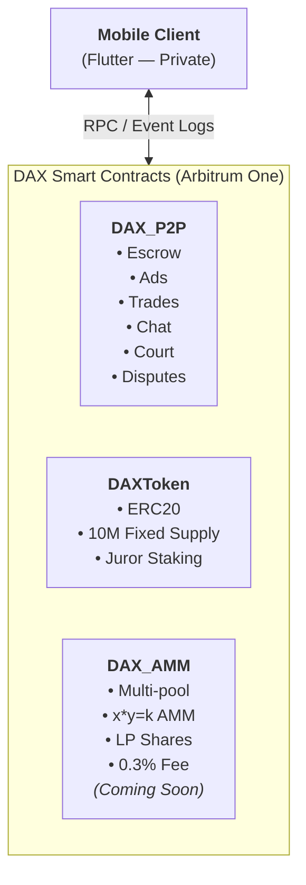
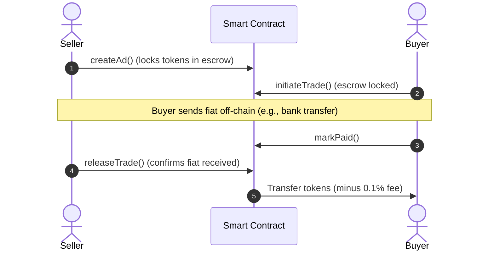

<p align="center">
  
</p>

<h1 align="center">DAXVault — Trustless P2P Crypto Exchange</h1>

<p align="center">
  <strong>Fully on-chain, self-custodial P2P escrow exchange with decentralized dispute resolution</strong>
</p>

<p align="center">
  <a href="https://arbiscan.io/address/0xc0eF9A343Fb0fC17fB424a4ED7234a059233A83B#code">
    
  </a>
  <a href="https://arbiscan.io/address/0xc0eF9A343Fb0fC17fB424a4ED7234a059233A83B#code">
    
  </a>
  
  
  
</p>

---

## Overview

**DAXVault** is a trustless peer-to-peer (P2P) crypto exchange that operates entirely on-chain. It enables anyone in the world to buy and sell crypto using local fiat currencies — without KYC, centralized servers, or custodial risk.

There is **no backend, no database, and no API**. The entire platform runs on smart contracts deployed to [Arbitrum One](https://arbitrum.io/), with a cross-platform mobile client that reads contract state and event logs directly from the blockchain.

### Why DAXVault?

| Problem | DAXVault Solution |
|:---|:---|
| Centralized exchanges custody user funds and are vulnerable to hacks | **Self-custodial** — users hold their own private keys |
| KYC requirements exclude billions in emerging markets | **No KYC** — wallet address is the only identity needed |
| Platform databases can be breached, exposing user data | **No database** — all state lives on-chain, nothing to breach |
| Centralized dispute resolution is opaque and biased | **Decentralized Court** — community jurors vote on evidence |
| High fees on centralized P2P platforms | **0.1% escrow fee** — minimal and transparent |

---

## Architecture





---

## Deployed Contracts (Arbitrum One Mainnet)

| Contract | Address | Arbiscan |
|:---|:---|:---|
| **DAX_P2P** (Escrow) | `0xc0eF9A343Fb0fC17fB424a4ED7234a059233A83B` | [View](https://arbiscan.io/address/0xc0eF9A343Fb0fC17fB424a4ED7234a059233A83B#code) |
| **DAX Token** | `0xAB1Da50c33D43b27fF96e502cBaC99e8EB378A92` | [View](https://arbiscan.io/address/0xAB1Da50c33D43b27fF96e502cBaC99e8EB378A92#code) |

### Supported Tokens

| Token | Address |
|:---|:---|
| USDT | `0xFd086bC7CD5C481DCC9C85ebE478A1C0b69FCbb9` |
| USDC | `0xaf88d065e77c8cC2239327C5EDb3A432268e5831` |
| WETH | `0x82aF49447D8a07e3bd95BD0d56f352415231aa11` |
| WBTC | `0x2f2a2543b76a4166549f7aab2e75bef0aefc5b0f` |

---

## Core Features

### 🔒 P2P Escrow Trading (`DAX_P2P.sol`)

- **Sell Ads**: Sellers lock tokens into the smart contract escrow. Buyers browse ads, initiate trades, send fiat off-chain, and receive crypto on-chain.
- **Buy Ads**: Buyers post interest to purchase. Sellers match the ad and deposit tokens into escrow at trade initiation.
- **Trade Lifecycle**: `Create Ad → Initiate Trade → Mark Paid → Release / Cancel / Dispute`
- **Buyer Cancel**: Buyers can cancel pending trades at any time, immediately unlocking seller's tokens.
- **Ad Management**: Update rate, limits, and payment methods without re-creating ads.

### ⚖️ Decentralized Dispute Resolution (Community Court)

- **Stake-based Arbitration**: Community members stake DAX tokens (min. 100 DAX) to become eligible jurors.
- **Evidence-based Voting**: When a trade is disputed, on-chain chat history is submitted as evidence. Jurors vote `Buyer` or `Seller`.
- **Incentive Alignment**: Correct jurors earn a share of the trade fee. Incorrect jurors get slashed (10 DAX per wrong vote).
- **Admin Supreme Court**: Treasury can break tie votes to prevent frozen funds.

### 💬 On-Chain P2P Chat

- Trade participants communicate through on-chain events (`P2pChatMessage`).
- Chat history is immutable and serves as evidence in disputes.
- No external messaging infrastructure required.

### 🪙 DAX Token (`DAXToken.sol`)

- Standard ERC20 with a **fixed supply of 10,000,000 DAX**.
- No mint function post-deployment — supply is permanently capped.
- Used for juror staking in the Community Court.

### 🔄 AMM Swap (`DAX_AMM.sol`) — Coming Soon

- Multi-pool constant product AMM (`x * y = k`).
- 0.3% swap fee: 0.25% to LPs, 0.05% to protocol treasury.
- LP share tracking per pool per user.

---

## Trade Flow





---

## Development

### Prerequisites

- Node.js ≥ 18
- npm

### Setup

```bash
git clone https://github.com/daxp2p/dax-protocol.git
cd dax-protocol
npm install
cp .env.example .env
# Edit .env with your private key and RPC URLs
```

### Compile

```bash
npx hardhat compile
```

### Test

```bash
npx hardhat test
```

### Deploy (Local)

```bash
npx hardhat node
npx hardhat run scripts/deploy.js --network localhost
```

### Deploy (Arbitrum Mainnet)

```bash
npx hardhat run scripts/deploy_mainnet.js --network arbitrum
```

### Verify on Arbiscan

```bash
npx hardhat verify --network arbitrum <CONTRACT_ADDRESS> <CONSTRUCTOR_ARGS>
```

### Linting & Security

```bash
# Solidity linting
npm run lint:sol

# Security analysis (requires Slither)
npm run security:slither

# Full scan
npm run scan
```

---

## Security

- **ReentrancyGuard**: All state-changing functions protected against reentrancy attacks.
- **SafeERC20**: All token transfers use OpenZeppelin's SafeERC20 to handle non-standard ERC20 implementations.
- **Input Validation**: All limits, amounts, and addresses validated before state changes.
- **Slither Audited**: Static analysis performed with Slither.
- **SolHint Linted**: Code follows Solidity best practices enforced by SolHint.

---

## Fee Structure

| Action | Fee | Recipient |
|:---|:---|:---|
| P2P Trade Completion | 0.1% (10 bps) | Protocol Treasury |
| Dispute (Buyer Wins) | 50% of trade fee to winning jurors | Jurors + Treasury |
| Incorrect Dispute Vote | 10 DAX slashed | Winning Jurors |
| AMM Swap (Coming Soon) | 0.3% (0.25% to LPs, 0.05% to Treasury) | LPs + Treasury |

---

## Project Structure

```
├── contracts/
│   ├── DAX_P2P.sol          # P2P Escrow with Court System
│   ├── DAXToken.sol          # Platform ERC20 Token
│   ├── DAX_AMM.sol           # AMM Swap (Coming Soon)
│   └── MockToken.sol         # Test helper token
├── scripts/
│   ├── deploy.js             # Local deployment
│   ├── deploy_mainnet.js     # Mainnet deployment
│   ├── deploy_p2p.js         # P2P-only deployment
│   └── ...                   # Utility scripts
├── test/
│   └── DAX.test.js           # Comprehensive test suite
├── hardhat.config.js         # Network & compiler config
├── .solhint.json             # Linting rules
└── .env.example              # Environment template
```

---

## Contributing

We welcome contributions! Please open an issue first to discuss proposed changes.

1. Fork the repo
2. Create a feature branch (`git checkout -b feature/my-feature`)
3. Commit your changes
4. Push to the branch
5. Open a Pull Request

---

## License

This project is licensed under the [MIT License](LICENSE).

---

<p align="center">
  <strong>DAX — Trade Crypto. Trust No One.</strong>
</p>
